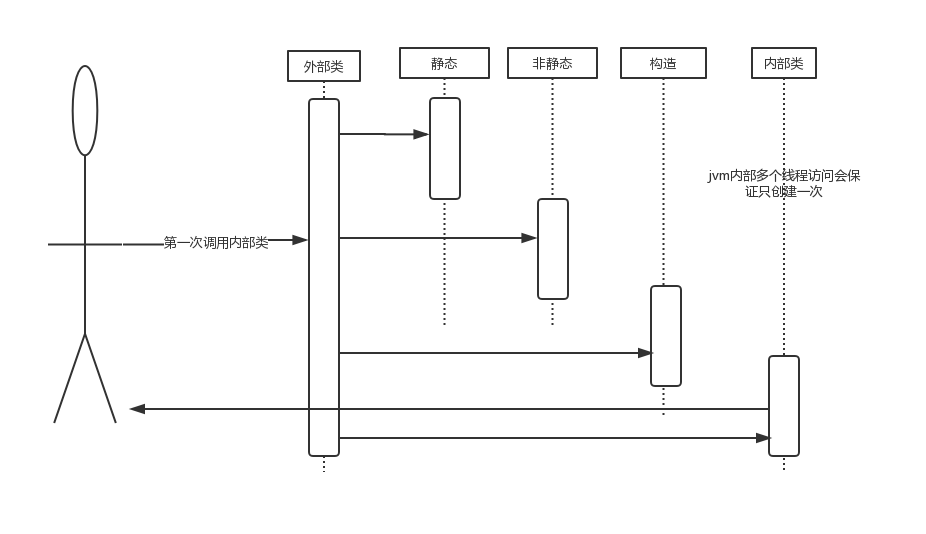

###单例模式课后作业
##1、熟练掌握单例模式的常见写法。
  * 饿汉式创建
  * 懒汉式、同步、双重检验索、内部类式创建
  * 注册式容器、枚举类创建
  * ThreadLocal
##2、总结每种单例写法的优、缺点。
  * 饿汉式缺点类不使时也创建对象浪费内存空可被序列化
    * 优点写法简单易理解
  * 懒汉同步需要加锁操作相对于线程来说慢缺点是需要排队可被序列化
    * 优点是线程安全的
  * 注册式容器是配合懒汉和饿汉式使用的对象可被序列化
    * 优点枚举类利用jvm的枚举特性巧妙不能被序列化
  
##3、思考破坏单例模式的方式有哪些？并且归纳总结。
  * 反射
  * 序列化
##4、梳理内部类的执行逻辑，并画出时序图。
  * 内部类是延时加载的，也就是说只会在第一次使用时加载。不使用就不加载。
  
  